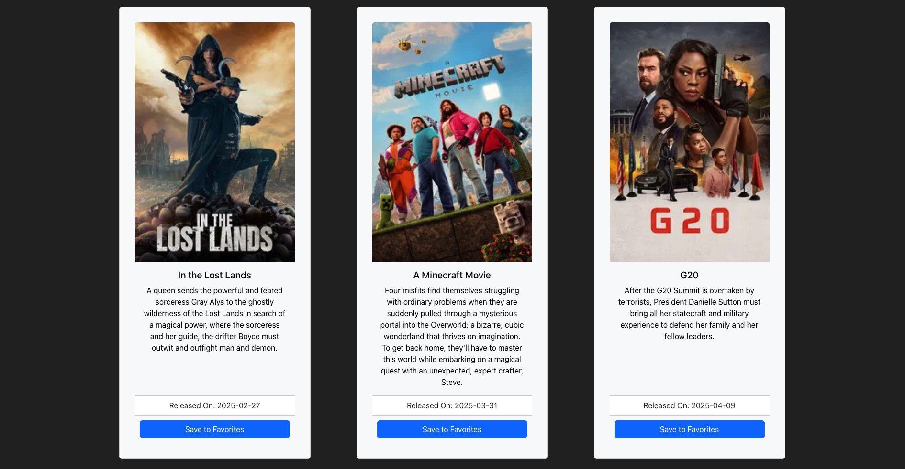

# Just Watch It

## Description

This is a web application to search for new and intriguing movies to watch and save them for later to watch when you have time.

## Table of Contents

- [Usage](#usage)
- [Credits](#credits)
- [Resources](#resources)
- [License](#license)
- [Questions](#questions)

## Usage

Upon navigating to the webpage, you will see this home page.

It displays the welcome message and a quick prompt to checkout the functionality of the site. We also included a random quote sourced from an API to provide something fun for the user to view.

In the navbar, there are four pages to navigate to, "Home", "Movie Database", "Groups", and "My Movies". The "Home" and "Movie Database" pages are functional for all users, but the "Groups" and "My Movies" pages require the user to be logged in in order to be used properly. 

*** NOTE! The "Groups" page currently has no real functionality and is part of the longer term upgrade plans. ***

All users will need a login. To create a login when first using the website, click on the "Login" button in the navbar. It will take you to this page.

Click the "Signup" button and enter a username, email, and password.

*** NOTE! There are currently no prompts to inform you that the login was successfully created, so all you'll likely see is that the entry boxes go blank. This should indicate a successful signup. This also applies to all the other user interactions with the page. We apologize for the inconvenience and plan to update this in the future. ***

Once you've completed the signup process, go back to the login page, enter your new username and password, and press "Login". If successful, this should redirect you the "Home" page. From here, go to the "Movie Database" page.

You can scroll through the list of movies and click the "Save to Favorites" button if you would like to save the movie to your list. Clicking the "Previous" and "Next" buttons on the bottom of the page will allow you to move through the different pages of movies. The website is capable of accessing 500 pages of movies so feel free to browse as much as you'd like!

To view your saved movies, navigate to the "My Movies" page. There you should see your saved movies listed. These movies are saved to your specific account, so once you logout, you will no longer have access to them until you log back in. 

That about it for our current version of Just Watch It. Feel free to reach out about any bugs or suggestions or with any questions by using the contanct links in the [Questions](#questions) section of this README.

## Credits

Collaborators
- John Goldade: Project Lead
- Jacob Peterson: Database Engineer, Front-End Dev
- Kinnedy Keating: Front-End Dev
- Brett Lintgen: Outside APIs, Back-End Dev

## Resources

- The logo for the website that was used for the browser tab icon and the title was [created by smashingstocks](https://www.flaticon.com/free-icons/movies) and was downloaded from [Flaticon](https://www.flaticon.com/)
- We used [TMDB](https://www.themoviedb.org/?language=en-US) for our movies API
- We used [API Ninjas](https://www.api-ninjas.com/api/quotes) for our quotes API
- The header background of Batman looking over Gotham was taken from [reddit](https://www.reddit.com/r/wallpaper/comments/wni90/batman_looking_at_gotham_city/)

## License

Licensed under the [MIT](./LICENSE) license.

## Questions
For questions contact project lead John Goldade at his [email](goldade.john@gmail.com) or [GitHub](https://github.com/Johngoldade)

or our contributors:
- Jacob Peterson @ [GitHub](https://github.com/Jpeterson1118)
- Kinnedy Keating @ [GitHub](https://github.com/Kinnedy)
- Brett Lintgen @ [GitHub](https://github.com/blintgen)